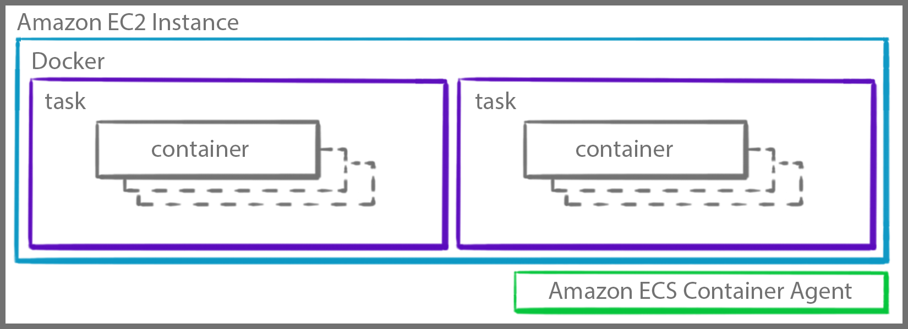
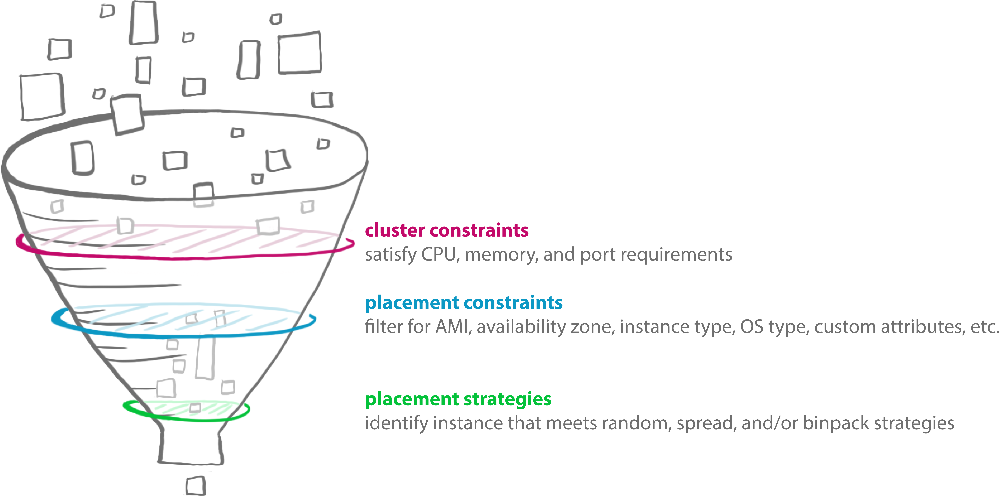

# Tutorial Dojo - DVA-C02 - Timed Mode Set 3

Test time: Dec 7 2023, 9h45 - 10h28 (00:47:24)

Score: 56/65 (86.15%)

- CDA – Development with AWS Services: 85.71%
- CDA – Security: 81.08%
- CDA – Deployment: 100%
- CDA – Troubleshooting and Optimization: 91.67%

## Domain 1: Development with AWS Services

| No  |     | Q                                                                  | A                                                                                                 | Ref |
| --- | --- | ------------------------------------------------------------------ | ------------------------------------------------------------------------------------------------- | --- |
|     |     |                                                                    |                                                                                                   |     |
| 1   | ✅  |                                                                    |                                                                                                   |     |
| 2   | ✅  |                                                                    |                                                                                                   |     |
| 3   | ❌  | API Gateway: Lambda Proxy integration                              | Recommend: Simple setup                                                                           |     |
| 4   | ✅  |                                                                    |                                                                                                   |     |
| 5   | ✅  |                                                                    |                                                                                                   |     |
| 6   | ✅  |                                                                    |                                                                                                   |     |
| 7   | ✅  |                                                                    |                                                                                                   |     |
| 8   | ✅  |                                                                    |                                                                                                   |     |
| 9   | ✅  |                                                                    |                                                                                                   |     |
| 10  | ✅  |                                                                    |                                                                                                   |     |
| 11  | ✅  |                                                                    |                                                                                                   |     |
| 12  | ❌  | Deploy serverless app: Run C++                                     | Lambda doesn't support C++ -> Create **custom runtime**                                           |     |
| 13  | ✅  |                                                                    |                                                                                                   |     |
| 14  | ❌  | SQS: postpone delivery messages to queue                           | `Delay queue` (not using `visibility timeout`)                                                    |     |
| 15  | ✅  |                                                                    |                                                                                                   |     |
| 16  | ❌  | ECS: EC2. Task placement?                                          | 1. Cluster constraint; 2. Task placement constraint; 3. Task placement strategy                   |     |
| 17  | ✅  |                                                                    |                                                                                                   |     |
| 18  | ❌  | Kinesis Data Streams: Resharding, Scaling, and Parallel Processing | 1. One worker can process many shards. 2. Optimal ratio is `1 worker : 1 shard`                   |     |
|     |     |                                                                    | Enhanced Fan-out: stream consumers receive their own 2MB/second pipe of read throughput per shard |     |
| 19  | ❌  | DynamoDB: Concurrency write                                        | Optimistic Locking + Conditional Writes                                                           |     |
| 20  | ❌  | DynamoDB: For each request, return WCU consumed (base table & GSI) | `ReturnConsumedCapacity`: ~~NONE~~ (default), ~~TOTAL~~, **INDEXES**                              |     |
| 20  | ✅  |                                                                    |                                                                                                   |     |
| 21  | ✅  |                                                                    |                                                                                                   |     |
| 22  | ✅  |                                                                    |                                                                                                   |     |
| 23  | ✅  |                                                                    |                                                                                                   |     |
| 24  | ✅  |                                                                    |                                                                                                   |     |
| 25  | ✅  |                                                                    |                                                                                                   |     |
| 26  | ✅  |                                                                    |                                                                                                   |     |
| 27  | ✅  |                                                                    |                                                                                                   |     |
| 28  | ✅  |                                                                    |                                                                                                   |     |
| 29  | ✅  |                                                                    |                                                                                                   |     |
| 30  | ✅  |                                                                    |                                                                                                   |     |
| 20  | ✅  |                                                                    |                                                                                                   |     |
| 21  | ✅  |                                                                    |                                                                                                   |     |
| 22  | ✅  |                                                                    |                                                                                                   |     |
| 23  | ✅  |                                                                    |                                                                                                   |     |
| 24  | ✅  |                                                                    |                                                                                                   |     |
| 25  | ✅  |                                                                    |                                                                                                   |     |
| 26  | ✅  |                                                                    |                                                                                                   |     |
| 27  | ✅  |                                                                    |                                                                                                   |     |
| 28  | ✅  |                                                                    |                                                                                                   |     |
| 29  | ✅  |                                                                    |                                                                                                   |     |
| 30  | ✅  |                                                                    |                                                                                                   |     |
| 31  | ✅  |                                                                    |                                                                                                   |     |
| 32  | ✅  |                                                                    |                                                                                                   |     |
| 33  | ✅  |                                                                    |                                                                                                   |     |
| 34  | ✅  |                                                                    |                                                                                                   |     |
| 35  | ✅  |                                                                    |                                                                                                   |     |
| 36  | ✅  |                                                                    |                                                                                                   |     |
| 37  | ✅  |                                                                    |                                                                                                   |     |

### 1.3 API Gateway API integration type

[Choose an API Gateway API integration type](https://docs.aws.amazon.com/apigateway/latest/developerguide/api-gateway-api-integration-types.html)

API Gateway - API integration types:

- `AWS`
  - `Lambda non-proxy` integration (`Lambda custom` integration): Need to specify how to map between `method` & `integration`
- `AWS Proxy`
  - `Lambda proxy` integration (Recommend): Simple setup
    - API Gateway maps the entire client request to the input `event` parameter of the backend Lambda function
- `HTTP`
- `HTTP Proxy`
- `Mock`

### 1.16 ECS task placement

ECS Task Placement

- Task placement: Which **container instances** to place task?

  - "Cluster constraint": Which one satisfy CPU, memory, port (in task definition)?

  - A **task placement _constraint_** is a rule that's considered during task placement.

    - Constraint _type_

      - distinctInstance
      - memberOf

    - Expression: defined in `cluster query language` (`subject operator [argument]`)

      - Attribute:
        - Build-in attribute:
          e.g. `ecs.availability-zone`, `ecs.instance-type`
        - Optional attribute:
        - Custom attribute: `stack`

      e.g. `attribute:ecs.availability-zone == us-east-1a`

  - A **task placement _strategy_** is an algorithm for selecting container instances for task placement or tasks for termination:
    ECS supports 3 type of task placement strategy:
    - `binpack`: min unused CPU, memory
    - `random`
    - `spread`: evenly based on
      - : `instanceId`/`host`, `attribute:ecs.availability-zone`, ...

Ref:

- <https://aws.amazon.com/blogs/compute/amazon-ecs-task-placement/>
- <https://docs.aws.amazon.com/AmazonECS/latest/developerguide/cluster-query-language.html>

### 1.18 Kinesis Data Streams

<https://aws.amazon.com/blogs/aws/kds-enhanced-fanout/>

### 1.19 DynamoDB: Concurrency write

- Atomic Counter: 🛣️ Any one can writes (The database use the previous value)
- Optimistic locking & Conditional write: ⚠️ Many writes at a time (based on some condition)
- Pessimistic locking: 🛑 1 write at a time. Wait for your turn

## Domain 2: Security

| No  |     | Q   | A   | Ref |
| --- | --- | --- | --- | --- |
|     |     |     |     |     |
| 1   | ✅  |     |     |     |
| 2   | ✅  |     |     |     |
| 3   | ✅  |     |     |     |
| 4   | ✅  |     |     |     |
| 5   | ✅  |     |     |     |
| 6   | ✅  |     |     |     |
| 7   | ✅  |     |     |     |
| 8   | ✅  |     |     |     |
| 9   | ✅  |     |     |     |

## Domain 3: Deployment

| No  |     | Q                                                                             | A                                            | Ref |
| --- | --- | ----------------------------------------------------------------------------- | -------------------------------------------- | --- |
|     |     |                                                                               |                                              |     |
| 1   | ✅  |                                                                               |                                              |     |
| 2   | ✅  |                                                                               |                                              |     |
| 3   | ✅  |                                                                               |                                              |     |
| 4   | ✅  |                                                                               |                                              |     |
| 5   | ✅  |                                                                               |                                              |     |
| 6   | ❌  | CodeDeploy deployment type (How the latest revision is deployed to instance?) | 1. In-place (EC2/On-Premises); 2. Blue/green |     |
| 7   | ✅  |                                                                               |                                              |     |

### 3.6 CodeDeploy deployment type

[Overview of CodeDeploy deployment types](https://docs.aws.amazon.com/codedeploy/latest/userguide/welcome.html#welcome-deployment-overview)
[CodeDeploy concepts](https://docs.aws.amazon.com/codedeploy/latest/userguide/primary-components.html#primary-components-deployment-type)

CodeDeploy can deploy application to 3 platform (called **deployment platform**):

- EC2/On-Premises <= Needs CodeDeploy agent
- ECS
- Lambda

CodeDeploy make the latest application _revision_ available on instance in a **deployment group** (a group of instances)

- In-place deployment: only support EC2/On-Premise
- Blue/green deployment

CodeDeploy supports 3 ways of routing traffic (via **deployment configuration**)

- All-at-once: 100%
- Canary: 2 increments: 10% + 90%
- Linear: n% x m times

## Domain 4: Troubleshooting and Optimization

| No  |     | Q                                                             | A                                                          | Ref |
| --- | --- | ------------------------------------------------------------- | ---------------------------------------------------------- | --- |
|     |     |                                                               |                                                            |     |
| 1   | ❌  | Collect trace from multiple backends, AWS SDK, SQL queries... | AWS Distro for OpenTelemetry (supports collect from X-Ray) |     |
| 2   | ✅  |                                                               |                                                            |     |
| 3   | ✅  |                                                               |                                                            |     |
| 4   | ✅  |                                                               |                                                            |     |
| 5   | ✅  |                                                               |                                                            |     |
| 6   | ✅  |                                                               |                                                            |     |
| 7   | ✅  |                                                               |                                                            |     |
| 8   | ✅  |                                                               |                                                            |     |
| 9   | ✅  |                                                               |                                                            |     |
| 10  | ✅  |                                                               |                                                            |     |
| 11  | ✅  |                                                               |                                                            |     |
| 12  | ✅  |                                                               |                                                            |     |
